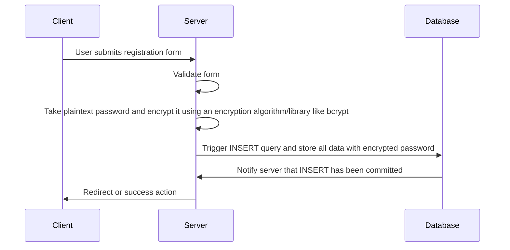
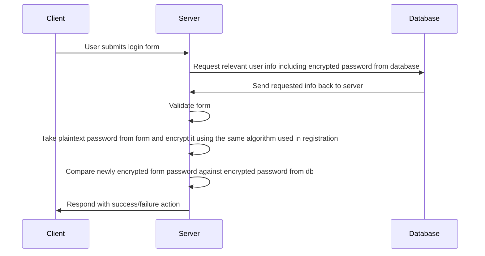

# Password Hashing

Obviously, it is of utmost importance that we do not store plaintext user passwords in the event that our database is compromised. Below is a diagram of how "password hashing" works.

## Registration/Storing Data

## Login/Verifying Password
